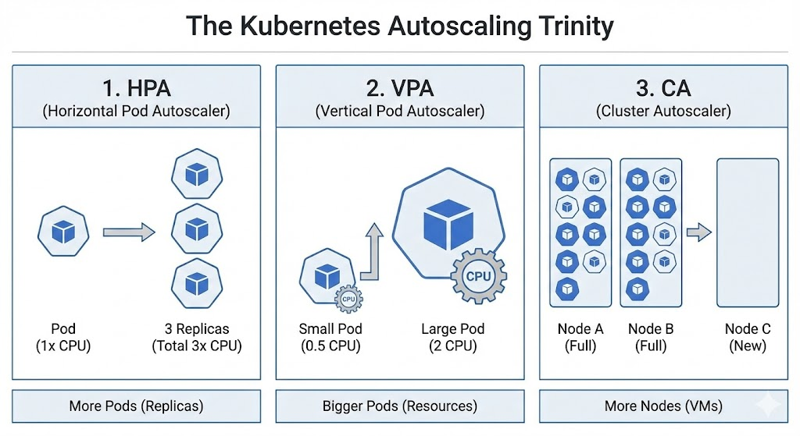

# 📈 Kubernetes Autoscaling: The Trinity

Kubernetes can scale your application automatically based on demand. There are three distinct layers of scaling that work together.

---

## 🏗️ The Scaling Layers

### 1. HPA (Horizontal Pod Autoscaler)
* **What it does:** Adds or removes **Pods**.
* **Analogy:** Opening more checkout lanes at a grocery store.
* **Metric:** Usually based on CPU or Memory % (via Metrics Server).

### 2. VPA (Vertical Pod Autoscaler)
* **What it does:** Increases or decreases **CPU/RAM** of existing Pods.
* **Analogy:** Giving a single cashier a faster computer.
* **Constraint:** Usually requires a Pod restart to apply changes.

### 3. CA (Cluster Autoscaler)
* **What it does:** Adds or removes **Nodes** (Virtual Machines).
* **Analogy:** Building an entire new wing of the grocery store because the building is full.

*Figure 3: Comparison of Horizontal, Vertical, and Cluster scaling.*

---

## ⚖️ Requests vs. Limits (The Scaling Foundation)
For autoscaling to work, you MUST define these in your container spec:

* **Requests:** The *minimum* K8s guarantees. (Used by VPA to see if you need more).
* **Limits:** The *maximum* a container can take. (K8s will kill the pod if it exceeds Memory limits).

---

## 🔍 Troubleshooting Scaling
* **Check Metrics:** `kubectl top pods` (See real-time CPU/RAM usage).
* **Check HPA Status:** `kubectl get hpa` (See current vs. target percentages).
* **Describe HPA:** `kubectl describe hpa [name]` (See why it isn't scaling).

## 🛠️ Essential Scaling Commands
* **See Top Usage:** `kubectl top pods` (Requires Metrics Server)
* **View HPA Status:** `kubectl get hpa`
* **Check Node Capacity:** `kubectl describe nodes | grep -A 5 Allocated`

---

**Pro-Tip:** Never run HPA and VPA on the same resource for the same metric (e.g., CPU). They will fight each other: VPA will try to make the pod bigger while HPA tries to add more pods.