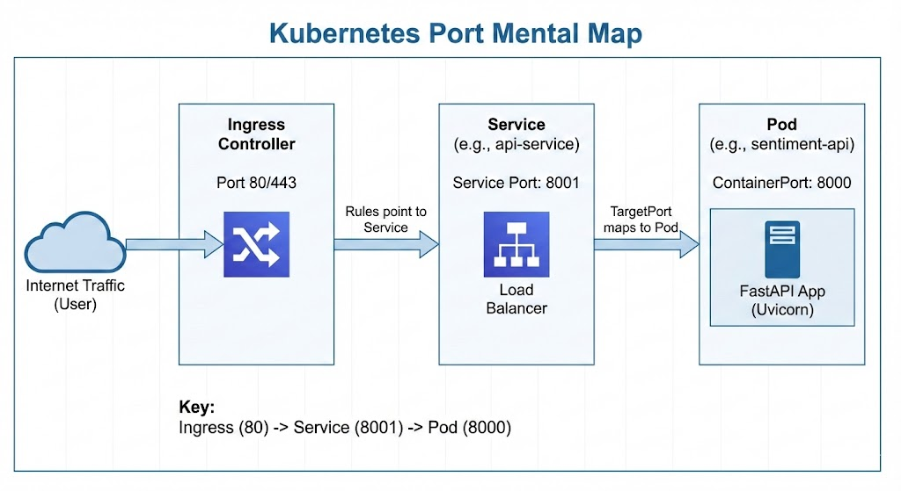

# ☸️ Kubernetes "Master Glue" & Survival Guide

For a DevOps engineer, Kubernetes is the "Operating System" of the data center. Your job isn't just to keep it running, but to ensure that developers can ship code without worrying about the underlying hardware.

## 🔍 Part 1: Cluster Introspection (What am I running?)
Use these to understand the boundaries and components of your current environment.

| Goal | Command |
| :--- | :--- |
| **Cluster Basics** | `kubectl cluster-info` (Check if you are on Minikube, K3s, or Cloud) |
| **The Hardware** | `kubectl get nodes -o wide` (See your Workers and their Internal/External IPs) |
| **The Big Picture** | `kubectl get all -A` (See EVERYTHING across all namespaces) |
| **Health Check** | `kubectl get componentstatuses` (Are the Scheduler and Controller-Manager healthy?) |
| **IP Ranges** | `kubectl cluster-info dump | grep -i service-cluster-ip-range` (Find the network CIDR) |
| **API Resources** | `kubectl api-resources` (The "Menu" of every object type available to you) |

---

## 🖇️ Part 2: The "Port-Glue" Validator (Is it wired correctly?)
When your API isn't responding, use this 4-step diagnostic flow to find the broken link.

### 1. The "Label Match" (Service to Pod)
If the Service doesn't find the Pods, the traffic hits a wall.
* **Check the Bridge:** `kubectl get endpoints [service-name]`
* **Diagnosis:** * If `ENDPOINTS` is `<none>`, your Service `selector` is wrong.
    * If `ENDPOINTS` has IPs, the bridge is good.

### 2. The "Port Handshake" (Pod to Service)
Ensure the "Entrance" and "Exit" ports align.
* **Check the Manifests:**
    * `Pod.spec.containers.ports.containerPort` (The App's actual hole: **8000**)
    * `Service.spec.ports.targetPort` (The Service's exit: **Must be 8000**)
    * `Service.spec.ports.port` (The Service's entrance: **e.g., 8001**)

### 3. The "Network Sandwich" (Ingress to Service)
* **Check the Ingress:** `kubectl describe ingress [ingress-name]`
* **Validation:** Look at the `Backends` section. It should list your Service name and the **Service port** (8001), followed by the Pod IPs.

### 4. The "Internal Connectivity" Test
Test from *inside* the cluster to bypass external firewalls/tunnels.
* **Run this:** `kubectl run net-check --image=curlimages/curl -i --tty --rm -- curl -v http://[service-name]:[service-port]/status`

---

## 🚧 Part 3: Port Management & Local Conflict Resolution
Why does `port-forward` fail? Usually, your local machine (IdeaPad) is already using that "parking spot."

### 🚨 The "Danger Zone": Reserved & Well-Known Ports
Avoid using these as your **Local Host Port** (the left side of a `:` mapping) because they are likely owned by your OS.

| Port | Standard Service | Conflict Risk |
| :--- | :--- | :--- |
| **22** | **SSH** | **HIGH**: Mapping this can lock you out of remote server access. |
| **53** | **DNS** | **HIGH**: Blocked by `systemd-resolved` on most Linux distros. |
| **80 / 443** | **HTTP / HTTPS** | **MED**: Requires `sudo` to use; usually owned by local web servers. |
| **3306 / 5432** | **MySQL / Postgres** | **MED**: Blocked if you have a local DB engine installed. |
| **5000** | **AirPlay / Flask** | **LOW**: MacOS uses this for AirPlay; causes "invisible" 403 errors. |

### ✅ The "Safe Zone": Recommended Custom Mapping Ranges
Use these ranges for the **Local** side of your tunnels (e.g., `kubectl port-forward svc/name 8080:8001`) to avoid system conflicts.

| Use Case | Recommended Range | Example Mapping |
| :--- | :--- | :--- |
| **Web / APIs** | `8000 - 8099` | `8080:8001` |
| **Dashboards / UI** | `9000 - 9099` | `9090:80` |
| **Custom SSH** | `2222 - 2299` | `2222:22` |
| **Dev Databases** | `15432 / 13306` | `15432:5432` |
| **Ephemeral/Random**| `49152 - 65535` | *(Private range, always safe)* |

### 🛠️ Local Debugging Commands
If you get "Address already in use":
* **Find the Culprit:** `sudo lsof -i :[PORT_NUMBER]` (Shows the process name and PID).
* **Kill the Culprit:** `sudo kill -9 [PID]` (Only if you're sure it's safe to stop).
* **The "Safe Range":** Use ports between **49152–65535** for local mappings.

---

## 🚀 Part 4: Essential Commands Cheat Sheet

### 🏃 Working with Workloads
* `kubectl get pods -w` : Watch pods change status in real-time.
* `kubectl logs -f deployment/[name]` : Stream logs from all replicas at once.
* `kubectl rollout restart deployment/[name]` : The "Refresh" button for ConfigMaps/Secrets.
* `kubectl rollout history deployment/[name]` : Check your revision history.

### 🔧 Debugging & Tunnels
* `export KUBE_EDITOR="nano"` : Set a human-friendly editor for `kubectl edit`.
* `kubectl describe pod [name]` : Check the "Events" list for crash reasons.
* `kubectl port-forward svc/[name] 8080:[svc-port]` : **Tunnel Logic:** `Localhost:8080` -> `Service:Port`.

### ⎈ Helm (Package Management)
* `helm list -A` : See all installed "Releases" across the cluster.
* `helm install [name] [chart] -f values.yaml` : Deploy a package with custom settings.
* `helm upgrade [name] [chart]` : Update an existing deployment.
* `helm uninstall [name]` : Remove everything associated with the app.

### 🔐 Secrets & Data
* **Decode Secret:** `kubectl get secret [name] -o jsonpath='{.data}'` (Then Pipe to base64).
* **Verify Config:** `kubectl exec [pod-name] -- env` (See all variables actually inside the pod).

---

## 🗺️ Part 5: The Port Mental Map (Logic Reference)

1. **User Request** -> Hits **Ingress** (Port 80)
2. **Ingress Rule** -> Forwards to **Service Port** (e.g., 8001)
3. **Service** -> Translates to **targetPort** (e.g., 8000)
4. **Pod** -> Receives traffic on **containerPort** (8000)

*Figure 1: The Port-Glue logic for Ingress and Services.*

---

## 🧠 Part 6: Architectural Decision Map
Don't use a Deployment for everything. Match the tool to the behavior.

| If you need... | Use this Object | Real-world Example |
| :--- | :--- | :--- |
| **Scaling & Web Traffic** | **Deployment** | Web APIs, Microservices, Frontend. |
| **Unique Identity / DBs** | **StatefulSet** | PostgreSQL, Redis, Kafka (Pods named `-0`, `-1`). |
| **One-off Tasks** | **Job** | Database migrations, Image processing. |
| **Scheduled Tasks** | **CronJob** | Daily backups, generating weekly reports. |
| **Running on EVERY node**| **DaemonSet** | Log collectors (Fluentd), Monitoring (Prometheus). |

---

## 🚦 Part 7: The "Status" Decoder Ring
What to do when `kubectl get pods` looks ugly.

| Status | What it means | First Step to Fix |
| :--- | :--- | :--- |
| **Pending** | Cluster has no room. | `kubectl describe pod` -> Look for "Insufficient CPU/RAM". |
| **CrashLoopBackOff** | App started, then crashed. | `kubectl logs` -> Your code has a bug or missing config. |
| **ImagePullBackOff** | K8s can't find the image. | Check image name/tag or Docker registry credentials. |
| **Evicted** | Node ran out of disk/RAM. | Delete the pod or move it to a bigger node. |
| **Terminating** | Pod is stuck "dying". | Use the "Nuclear Option" (Force Delete) from Part 4. |

---

## 🦅 Part 8: The Bird's-Eye Glossary
If Kubernetes is a city, here is the map:

* **Cluster**: The entire "City." It’s the group of all your servers (Nodes) working together as one giant computer.
* **Node**: A single "Building" (server). It can be a physical machine or a virtual one. This is where your apps actually live.
* **Pod**: The "Apartment." It’s the smallest unit in K8s. A Pod wraps around your container (the "Resident") to give it a network IP and storage.
* **Deployment**: The "Property Manager." Its only job is to make sure the right number of Pods are always running. If one dies, the Deployment replaces it.
* **Service**: The "Street Address & Phone Operator." It gives your moving Pods a permanent internal name and load-balances traffic between them.
* **Namespace**: A "Gated Community." It lets you slice one Cluster into multiple virtual ones (e.g., `development` vs `production`) so they don't interfere.
* **Ingress**: The "City Gate." It’s the entry point that manages how people from the outside world get into your Services inside the cluster.
* **Control Plane**: The "City Hall." This is the collection of background processes that make decisions, handle events, and store the "truth" of the cluster.
* **Helm**: The "App Store" or "Package Manager." It bundles multiple K8s objects (Service, Deployment, Ingress) into a single **Chart** so you can install/update them all at once.

### 📡 Service Types (The Internal Wiring)
* **ClusterIP (Default)**: Internal "Private" IP. Reachable only by other Pods inside the cluster.
* **NodePort**: Opens a specific port (30000-32767) on every worker node. Used for simple external access without a LoadBalancer.
* **LoadBalancer**: Asks your cloud provider (AWS/GCP/Azure) for a real, external Public IP.

### 📦 Configuration & Secrets (The Data)
* **ConfigMap**: A dictionary of non-sensitive settings (like API URLs or "ENV=production") used to configure apps without rebuilding images.
* **Secret**: Identical to a ConfigMap but used for sensitive data (passwords, keys). Usually encoded in Base64 (obfuscated, not encrypted by default!).

### 💾 Persistent Storage (The "Disk")
* **PersistentVolume (PV)**: The actual physical storage (a cloud disk, a local SSD) created by an admin.
* **PersistentVolumeClaim (PVC)**: A "ticket" or "request" created by a user. K8s matches a PVC to a suitable PV and "binds" them together.
* **StorageClass**: The "Vending Machine" for storage. It automatically creates a PV when it sees a PVC.

### 🩺 Health Checks (The "Doctor")
* **Liveness Probe**: "Are you alive?" If this fails, K8s kills the container and restarts it.
* **Readiness Probe**: "Are you ready for work?" If this fails, K8s stops sending traffic to the Pod but keeps it running.

---

## Pro-Tips

### Pro-Tip 1: 
If `nslookup [service-name]` works inside a pod but `curl` fails, the problem is your **targetPort** mapping or the **App code**.

### Pro-Tip 2 (The Binding Trap):
Inside Docker/K8s, your app **MUST** listen on `0.0.0.0`, not `127.0.0.1`.
* `127.0.0.1` = "Talk only to myself inside this container." (Connection Refused from outside)
* `0.0.0.0` = "Listen for everyone on the network." (Correct for K8s)

### Pro-Tip 3 (The YAML Rule):
* **Metadata** = Labels/Names (The "How K8s finds it").
* **Spec** = Desired State (The "What I want to happen").
* **Status** = Actual State (The "What is actually happening").
* **K8s' only job is to make Status match Spec.**

### Pro-Tip 4 (The Golden Rule):
Kubernetes is **Declarative**, not Imperative. You don't tell K8s "Start a pod." You tell K8s "My desired state is 3 pods." K8s then looks at reality and does whatever it takes to make reality match your desire.

### Pro-Tip 5 (Probe Logic):
* Always use a **Readiness Probe** for apps that take time to start up (like Java or heavy APIs). 
* Be careful with **Liveness Probes**—if you point them at a database that is temporarily down, K8s might enter a "Restart Loop" and never recover!

### Pro-Tip 6 (Helm 3 vs 2):
If you see old tutorials mentioning **Tiller**, ignore them. Helm 3 is "client-only." It talks directly to the K8s API using your permissions. This makes it much more secure and easier to manage than the old version.